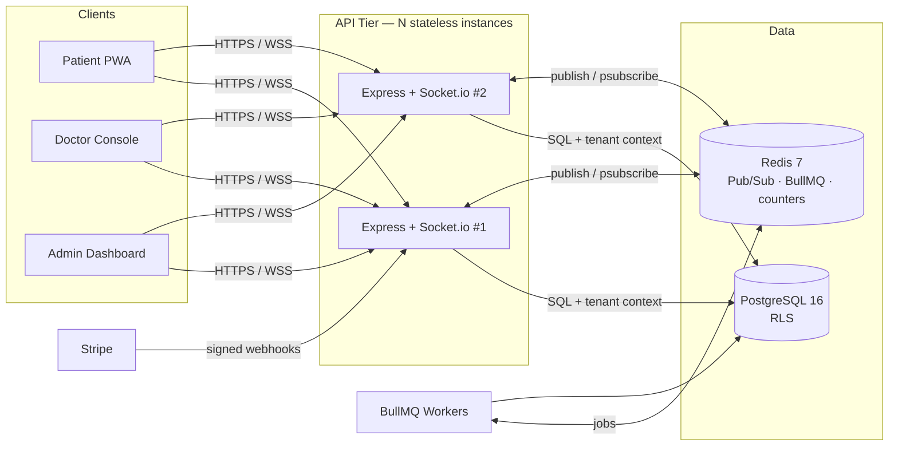
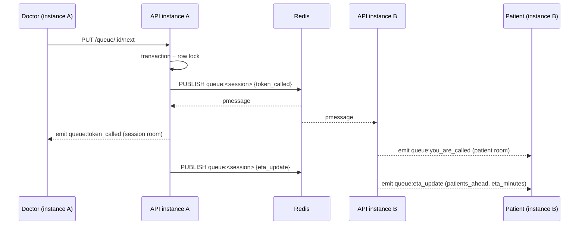

<div align="center">

# MediQueue

**Multi-tenant SaaS for real-time hospital queue & appointment management**

[](https://github.com/Monjur14/MediQueue/actions/workflows/ci.yml)
[](https://github.com/Monjur14/MediQueue/actions/workflows/deploy.yml)


[Live Demo](https://mediqueue.monjurhossen.online) · [API Docs](https://mediqueue-api.monjurhossen.online/api/docs) · [Architecture](#architecture) · [Engineering Notes](#engineering-deep-dives)

</div>

---

## Table of Contents

- [Overview](#overview)
- [Features](#features)
- [Architecture](#architecture)
- [Tech Stack](#tech-stack)
- [Getting Started](#getting-started)
- [Environment Variables](#environment-variables)
- [Project Structure](#project-structure)
- [API Reference](#api-reference)
- [Real-time Events](#real-time-events)
- [Testing](#testing)
- [CI/CD](#cicd)
- [Engineering Deep Dives](#engineering-deep-dives)
- [Design Decisions](#design-decisions)
- [Roadmap](#roadmap)
- [Contributing](#contributing)
- [Author](#author)
- [License](#license)

---

## Overview

Patients in Bangladesh routinely wait 3–5 hours at clinics with no visibility into where they stand in the queue. MediQueue gives every patient a live token with a real-time position and ETA, gives doctors a one-click queue console, and gives clinic owners analytics on throughput and wait times.

Built as a **multi-tenant SaaS**: clinics and doctors subscribe to a plan, patients use it for free. Every tenant's data is isolated at the database layer with PostgreSQL Row-Level Security — not just filtered in application code.

| Role | Capabilities |
|------|--------------|
| **Patient** | Take a token, see live queue position + ETA, get push alerts, access visit history |
| **Doctor** | Live queue console, call / skip / complete tokens, insert break windows |
| **Tenant Admin** | Manage doctors, departments, analytics, subscription, and invoices |
| **Super Admin** | Platform MRR, tenant health, usage limits, failed payments, audit logs |

---

## Features

**Queue Engine**
- Race-free token issuance with `SELECT … FOR UPDATE` row locking
- Dynamic ETA recalculation on every queue event (call, skip, break, no-show)
- No-show detection via BullMQ delayed jobs — auto-skips and recalculates
- Doctor break windows that shift every downstream ETA in real time

**Real-time**
- WebSocket updates across horizontally-scaled instances via Redis Pub/Sub
- Personal patient rooms — each patient receives only their own ETA, not a broadcast
- Thundering-herd mitigation: only the top 5 patients get immediate push; rest get a debounced batch

**Multi-tenancy & Security**
- PostgreSQL RLS on every tenant-scoped table; context set per-transaction with `set_config`
- Refresh token rotation with reuse detection — stolen token replays revoke all sessions
- Idempotency keys on token issuance; optimistic locking on consultation notes
- Redis sliding-window rate limiting per IP and per user

**SaaS & Billing**
- Stripe subscriptions with signature-verified, idempotent webhooks
- Subscription lifecycle state machine: Trial → Active → Past Due → Cancelled → Expired
- Redis usage counters for real-time plan-limit enforcement; nightly flush to PostgreSQL
- Feature gating middleware — plan limits enforced on every relevant action

**Observability**
- Structured JSON logging (Winston) with `requestId`, `userId`, `tenantId`, `action`, `duration`
- Liveness and readiness probes (`/health/live`, `/health/ready`)
- OpenAPI 3.0 docs auto-generated at `/api/docs`

---

## Architecture



The backend is a **modular monolith**. Each domain lives in `src/modules/<domain>` and follows the same layering:

```
routes → controller → service → repository → PostgreSQL
```

Controllers handle HTTP, services own business rules and publish domain events, repositories own SQL. Module boundaries are clean enough to extract any module into its own service without rewriting it.

### Request Pipeline

Every authenticated request passes through the same middleware chain:

```
helmet → cors → rateLimiter → authenticate → resolveTenant → requireRole
       → requireActiveSubscription → featureGate / usageMetering → handler → auditLog
```

### Real-time Flow



Queue services never talk to sockets directly — they publish domain events to Redis. Every API instance subscribes via `psubscribe` and emits only to its local sockets.

---

## Tech Stack

| Layer | Technology |
|-------|------------|
| **Frontend** | Next.js 16 (App Router), React 19, TypeScript, Tailwind CSS 4, Radix UI, TanStack Query, Zustand, Socket.io client, PWA (`next-pwa`, Web Push) |
| **Backend** | Node.js 20, Express 5, TypeScript (ESM, strict), Socket.io 4, Zod 4, BullMQ, Winston, Helmet |
| **Database** | PostgreSQL 16 (RLS), Redis 7, `node-pg-migrate` |
| **ORM / Query** | Raw SQL with `pg` — no ORM (required for `SELECT FOR UPDATE` and `set_config`) |
| **Integrations** | Stripe (subscriptions + webhooks), Resend (transactional email), Web Push (VAPID) |
| **Testing** | Vitest, Supertest (integration tests against live Postgres + Redis) |
| **DevOps** | Docker, Docker Compose, GitHub Actions CI + SSH-based CD, Swagger / OpenAPI 3 |

---

## Getting Started

### Prerequisites

- **Docker + Docker Compose** (recommended), or
- Node.js 20+, PostgreSQL 16, Redis 7 installed locally

### Quick Start with Docker

```bash
git clone https://github.com/Monjur14/MediQueue.git
cd MediQueue

# Copy env template — Stripe/Resend/VAPID keys optional for local dev
cp backend/.env.example backend/.env

docker compose up --build
```

| Service | URL |
|---------|-----|
| Frontend | http://localhost:3000 |
| API | http://localhost:5001 |
| Swagger UI | http://localhost:5001/api/docs |
| Readiness probe | http://localhost:5001/health/ready |

Migrations run automatically on backend start. Set `SEED_DEMO=true` to load demo tenants, doctors, and patients. `docker compose down -v` wipes the database volume.

### Manual Setup (no Docker)

```bash
# Terminal 1 — Backend
cd backend
npm install
cp .env.example .env               # fill in DATABASE_URL and REDIS_URL at minimum
npm run migrate:up
npm run seed-subscription-plans
npm run seed-super-admin
npm run dev                        # http://localhost:5001

# Terminal 2 — Frontend
cd frontend
npm install
npm run dev                        # http://localhost:3000
```

---

## Environment Variables

See [`backend/.env.example`](backend/.env.example) for the full list. The minimum required for local development are `DATABASE_URL` and `REDIS_URL`; all others are optional unless you need that specific feature (payments, email, push notifications).

| Variable | Purpose |
|----------|---------|
| `DATABASE_URL` | PostgreSQL connection string |
| `REDIS_URL` | Redis for Pub/Sub, BullMQ, rate limiting, and usage counters |
| `JWT_SECRET` | Signs short-lived access tokens (15 min) |
| `JWT_REFRESH_SECRET` | Signs long-lived refresh tokens (7 days) |
| `STRIPE_SECRET_KEY` | Stripe API key for subscription management |
| `STRIPE_WEBHOOK_SECRET` | Verifies webhook signature before processing |
| `RESEND_API_KEY` | Transactional email (doctor invite, receipts) |
| `EMAIL_FROM` | Sender address for outbound email |
| `VAPID_PUBLIC_KEY` | Web Push public key |
| `VAPID_PRIVATE_KEY` | Web Push private key |
| `FRONTEND_URL` | Allowed CORS origin for HTTP and WebSocket |
| `SEED_DEMO` | Set to `true` to seed demo data on startup |

---

## Project Structure

```
MediQueue/
├── backend/
│   └── src/
│       ├── config/             # Postgres pool, Redis client, BullMQ, Swagger, Web Push
│       ├── db/
│       │   ├── migrations/     # 12 versioned migrations, including RLS policies
│       │   └── seeds/          # Subscription plans, demo tenants, super admin
│       ├── middleware/         # authenticate, resolveTenant, requireRole,
│       │                       # rateLimiter, featureGate, usageMetering, auditLog
│       ├── modules/
│       │   ├── auth/           # JWT auth, refresh rotation, setup-password flow
│       │   ├── billing/        # Stripe webhooks, subscription state machine
│       │   ├── clinics/        # Public clinic search, department & doctor listing
│       │   ├── departments/    # Department CRUD, doctor assignment
│       │   ├── doctors/        # Doctor profile management
│       │   ├── patients/       # Patient profile, visit history
│       │   ├── queue/          # Session lifecycle, token issuance, call/skip/complete
│       │   ├── realtime/       # Socket.io server, Redis gateway, connection handler
│       │   └── tenants/        # Clinic management, doctor invites, analytics
│       ├── workers/            # BullMQ workers: no-show detection, push notifications
│       ├── tests/
│       │   ├── features/       # concurrentBooking, queueProgression, tenantIsolation
│       │   ├── integration/
│       │   └── unit/
│       └── utils/              # JWT helpers, ETA calculator, email, password hashing
├── frontend/
│   └── app/
│       ├── (auth)/             # Login, register, onboarding flows
│       └── (dashboard)/        # Patient queue, doctor console, admin, billing, super
├── .github/
│   └── workflows/
│       ├── ci.yml              # Type-check + build on every push and PR
│       └── deploy.yml          # SSH deploy to production on push to main
├── docker-compose.yml          # Local development
└── docker-compose.prod.yml     # Production (no volume mounts, restart policies)
```

---

## API Reference

**40 REST endpoints** across 8 modules, documented with OpenAPI 3.0 at `/api/docs`.

Every endpoint lists its required role, plan requirement, request/response schema, and error codes.

### Quick Reference

| Group | Endpoints |
|-------|-----------|
| **Auth** | Register patient/tenant, login, logout, refresh, setup-password, `GET /me` |
| **Clinics** | Search clinics, list departments, list doctors in department (all public) |
| **Tenants** | Update clinic, invite/list/update/remove doctors |
| **Departments** | CRUD, overview, assign/remove doctors |
| **Queue Sessions** | Open, close, get today's sessions, live status |
| **Queue Tokens** | Issue token, call next, check in, skip, complete, fee, notes |
| **Doctor Breaks** | Start break, end break |
| **Patients / Doctors** | Update own profile, view own token status |

**Example — issue a queue token:**

```bash
curl -X POST http://localhost:5001/api/queue/tokens/give \
  -H "Authorization: Bearer $ADMIN_TOKEN" \
  -H "Content-Type: application/json" \
  -d '{
    "session_id": "SESSION_UUID",
    "phone": "+8801722000001",
    "fee_amount": 500,
    "idempotency_key": "desk-1-20260929-042"
  }'
```

```json
{
  "token": {
    "id": "uuid",
    "token_number": 14,
    "status": "waiting",
    "fee_paid": false,
    "fee_amount": 500,
    "created_at": "2026-09-29T09:30:00.000Z"
  },
  "patient": {
    "id": "uuid",
    "full_name": "Rahim Uddin",
    "phone": "+8801722000001"
  }
}
```

---

## Real-time Events

Connect via Socket.io and join a session room to receive live updates.

```javascript
const socket = io('http://localhost:5001');
socket.emit('join:session', { sessionId: 'SESSION_UUID', token: ACCESS_TOKEN });
```

| Event | Room | Payload |
|-------|------|---------|
| `queue:token_issued` | session | `token_number`, `total_issued` |
| `queue:token_called` | session | `token_number`, `patient_id` |
| `queue:you_are_called` | patient | `token_number` |
| `queue:eta_update` | patient | `eta_minutes`, `patients_ahead`, `waiting_count` |
| `queue:token_skipped` | session | `token_id` |
| `queue:you_were_skipped` | patient | `token_id` |
| `queue:token_completed` | session | `token_number` |
| `queue:break_started` | session | `expected_duration` |
| `queue:break_ended` | session | `session_id` |
| `queue:session_closed` | session | `session_id` |

ETA updates go to personal patient rooms — each client only receives its own position, not the full list.

---

## Testing

Integration tests run against **real PostgreSQL and Redis** — the behaviour under test (row locks, RLS, Pub/Sub) doesn't exist in mocks.

```bash
cd backend

npm run test:concurrent   # 50 concurrent token requests → exactly 1 succeeds (FOR UPDATE)
npm run test:isolation    # tenant B querying tenant A's data → 0 rows (RLS)
npm run test:progression  # 5 patients, call-next 4 times → correct queue advance
npm run test:unit         # unit tests
npm run test:all          # all suites, verbose
```

**Test coverage for critical paths:**

| Test | What it proves |
|------|----------------|
| `concurrentBooking.test.ts` | `SELECT FOR UPDATE` serialises concurrent requests — exactly one token wins |
| `tenantIsolation.test.ts` | RLS blocks cross-tenant reads — no application-layer filter required |
| `queueProgression.test.ts` | Queue state machine advances correctly through every transition |

---

## CI/CD

**CI** (`ci.yml`) — runs on every push and pull request:
- Backend: `tsc --noEmit` type-check + build
- Frontend: ESLint + build

**CD** (`deploy.yml`) — runs on push to `main`:
- SSH into production host
- `git pull` + `docker compose -f docker-compose.prod.yml up --build -d`

> Integration tests currently run locally (they need live Postgres and Redis). Adding them to CI with service containers is on the roadmap.

---

## Engineering Deep Dives

### 1. Real-time across multiple instances

**Problem:** A doctor calling the next patient on instance A must push to a patient whose socket is held by instance B.

**Solution:** Queue services publish domain events to Redis (`PUBLISH queue:<sessionId>`). Every instance runs a gateway that `psubscribe`s to `queue:*` and emits only to its **local** sockets into two kinds of rooms: `session:<id>` for everyone watching the queue, and `patient:<id>` for a single patient's private channel.

Code: [`realtime/queue.gateway.ts`](backend/src/modules/realtime/queue.gateway.ts), [`realtime/socket.server.ts`](backend/src/modules/realtime/socket.server.ts)

---

### 2. Multi-tenant isolation with Row-Level Security

**Problem:** Filtering by `tenant_id` in application code means one missed `WHERE` leaks another clinic's data.

**Solution:** RLS is enabled on every tenant-scoped table. The `resolveTenant` middleware sets context per transaction:

```sql
SELECT set_config('app.current_tenant_id', $1, TRUE),
       set_config('app.current_user_id',   $2, TRUE),
       set_config('app.current_user_role', $3, TRUE);
```

The `TRUE` flag scopes each setting to the transaction, so pooled connections cannot carry one tenant's context into another request. Verified by [`tenantIsolation.test.ts`](backend/src/tests/features/tenantIsolation.test.ts) — tenant B querying tenant A's data gets zero rows.

Code: [`db/migrations/12_enable_rls.js`](backend/src/db/migrations/12_enable_rls.js), [`middleware/resolveTenant.ts`](backend/src/middleware/resolveTenant.ts)

---

### 3. Refresh token rotation and stolen-token detection

Access tokens live 15 minutes. Every `/auth/refresh` atomically replaces the stored refresh token with a new one. A token with a valid signature that no longer exists in the database can only be a replay of an already-rotated token — all sessions are revoked immediately.

| Incoming token | Result |
|----------------|--------|
| Present in DB | Rotate → new access + refresh token |
| Valid signature, absent from DB | **Reuse detected** → revoke all sessions, `401` |
| Invalid signature | `401 INVALID_REFRESH_TOKEN` |

Code: [`auth/auth.service.ts`](backend/src/modules/auth/auth.service.ts)

---

### 4. Race-free token issuance

Token issuance runs in a single transaction that first acquires a row lock:

```sql
BEGIN;
SELECT * FROM queue_sessions WHERE id = $1 AND status = 'open' FOR UPDATE;
-- capacity check → compute next token_number → INSERT token → bump counter
COMMIT;
```

Concurrent requests serialise on that lock; the losing requests see the updated count and fail with `QUEUE_FULL`. A client-supplied `idempotency_key` (cached in Redis, 24-hour TTL) handles double-submits from flaky networks — a retried request returns the original token instead of creating a second one.

Verified by [`concurrentBooking.test.ts`](backend/src/tests/features/concurrentBooking.test.ts): 50 concurrent requests for one slot → exactly one row in the table.

---

### 5. Stripe webhook idempotency

The raw request body is verified against `STRIPE_WEBHOOK_SECRET` before anything else. The event ID is checked against a `payment_events` idempotency store; a duplicate is acknowledged with `200` and ignored. Only new events reach the subscription state machine, preventing double-activation or duplicate receipts.

Code: [`billing/billing.service.ts`](backend/src/modules/billing/billing.service.ts)

---

### Also in the codebase

- **Dynamic ETA** on every queue event (call, skip, cancel, break), using rolling average consultation time and remaining break time — [`utils/eta.ts`](backend/src/utils/eta.ts)
- **Optimistic locking** on consultation notes via `notes_version`; stale writes are rejected with `409 Conflict`
- **Redis sliding-window rate limiting** per IP and per user — [`middleware/rateLimiter.ts`](backend/src/middleware/rateLimiter.ts)
- **Usage metering** with Redis `INCR` (O(1), atomic); nightly BullMQ job flushes to PostgreSQL — [`middleware/usageMetering.ts`](backend/src/middleware/usageMetering.ts)
- **Feature gating** enforces plan limits per action — [`middleware/featureGate.ts`](backend/src/middleware/featureGate.ts)
- **Append-only audit log** for all sensitive actions
- **Soft deletes** everywhere — `deleted_at` on all tables, never a hard delete

---

## Design Decisions

| Decision | Alternative considered | Rationale |
|----------|----------------------|-----------|
| PostgreSQL | MongoDB | Queue tokens, sessions, subscriptions, and invoices are relational and need ACID. A token must never exist without its session. |
| Row-Level Security | App-layer `WHERE tenant_id = $1` | RLS is enforced by the database, not by every developer remembering a filter. An application bug cannot leak cross-tenant data. |
| Raw SQL (`pg`) | Prisma / TypeORM | `SELECT FOR UPDATE`, `set_config`, and RLS require precise control over transactions and connections. Every query is visible and explainable. |
| Socket.io + Redis adapter | Raw `ws` | Built-in reconnection, rooms, and acknowledgements; the adapter makes instances interchangeable behind a load balancer. |
| BullMQ | `setTimeout` / cron | Jobs survive process restarts, retry with exponential backoff, and support delayed execution for no-show detection. |
| Redis usage counters | `COUNT(*)` per request | `INCR` is O(1) and atomic. Plan-limit checks happen on every booking — hitting Postgres for a count query on each request adds latency. |
| Modular monolith | Microservices | One deployable unit for a small team, with module boundaries (`routes → service → repository`) that allow extraction later if needed. |

---

## Roadmap

- [ ] Move integration tests into CI with Postgres and Redis service containers
- [ ] bKash / SSLCommerz gateway for the Bangladesh market (schema already supports it)
- [ ] WhatsApp notification layer with outbox pattern and SMS fallback + circuit breaker
- [ ] Bull Board dashboard for job inspection and dead-letter retries
- [ ] Prometheus metrics + OpenTelemetry tracing across HTTP → worker → WebSocket
- [ ] Shared Zod schemas between frontend and backend via a monorepo workspace package
- [ ] Queue Simulation Mode — fast-forward a full day's queue for capacity planning

---

## Contributing

Pull requests are welcome. For significant changes, please open an issue first to discuss what you'd like to change.

```bash
# 1. Fork and clone
git clone https://github.com/<your-handle>/MediQueue.git

# 2. Create a feature branch
git checkout -b feat/your-feature-name

# 3. Start the dev environment
docker compose up --build

# 4. Make your changes, then run the test suite
cd backend && npm run test:all

# 5. Open a pull request against main
```

**Commit convention:** `<type>(<scope>): <subject>` — e.g. `feat(queue): add break-window ETA recalc`, `fix(auth): revoke sessions on token reuse`.

---

## Author

**Monjur Hossen** — [GitHub](https://github.com/Monjur14) · [Portfolio](https://monjurhossen.online)


